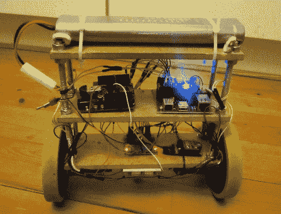

# 矮矮胖胖的平衡机器人非常稳定

> 原文：<https://hackaday.com/2012/03/07/short-and-squat-balancing-bot-is-extremely-stable/>

[Lauszus]真的组装了一个令人印象深刻的自平衡机器人平台。当保持平衡时，它实际上是静止的，即使在房间里行驶时，这种稳定性也不会丧失。

这一构建背后的部分成功是使用了高质量的组件。他有一套非常好的内置编码器的马达，可以向平衡系统提供反馈。它们与陀螺仪传感器和 PID 代码一起工作，以保持双轮平台直立。运行 96 MHz 的 mbed 板为平衡系统提供了充足的计算能力。但是在船上也可以找到 Arduino。这是为了方便与遥控器的蓝牙连接，因为[Lauszus]不想移植他已经编写的代码。

休息后的 14 分钟视频分享了 PID 控制器如何调整以及[Lauszus]如何实现目标角度和其他一些因素的细节。当然，他谈到了硬件选择，并通过使用无线 PS3 控制器驱动机器人来演示功能。

使用 masonite 条和螺纹杆的构造方法很好地保护了安装在其上的硬件。我们总是有点担心这些机器人会倒下，而且我们看到的一些项目很少或根本没有保护。有一种东西有助于防止溢出，那就是当电池电量低时会发出声音的压电蜂鸣器。

[https://www.youtube.com/embed/N28C_JqVhGU?version=3&rel=1&showsearch=0&showinfo=1&iv_load_policy=1&fs=1&hl=en-US&autohide=2&wmode=transparent](https://www.youtube.com/embed/N28C_JqVhGU?version=3&rel=1&showsearch=0&showinfo=1&iv_load_policy=1&fs=1&hl=en-US&autohide=2&wmode=transparent)