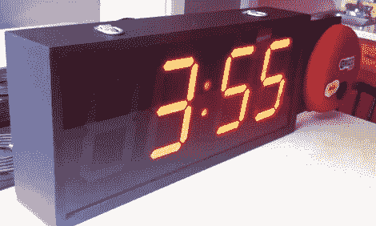

# 健身计时器有自己的铃声

> 原文：<https://hackaday.com/2012/03/08/workout-timer-has-its-own-fight-bell/>

这个健身计时器非常棒。我们认为[道格拉斯]设法以专业的外表和全面的特征结束，尽管他一路上做了很多学习。

他想要一个能够上下计数的时钟来记录他锻炼的不同阶段。为了真正有用，它需要有一个遥控器和时间用完时发出信号的方法。他抓起一个 Arduino，开始用 LED 字幕进行原型制作，但在添加了第二个 Arduino 来处理显示扫描问题后，他最终切换到这些 LED 段显示器。

计时器包括一个红外接收器，因此可以用手持遥控器控制。旁边的大红色铃铛有一个很大的铃铛，用来表示计时的开始和结束。也许那个钟的驱动程序可以从周三开始被整合到家庭自动化项目中。一旦硬件决定最终确定，[Douglas]就着手建造一个让他引以为豪的外壳(任务完成！).不要错过休息后的视频，在那里他走过用户界面的各个方面。T3

<https://www.youtube.com/embed/ECZYd6ET9P8?version=3&rel=1&showsearch=0&showinfo=1&iv_load_policy=1&fs=1&hl=en-US&autohide=2&wmode=transparent>

 </body> </html>