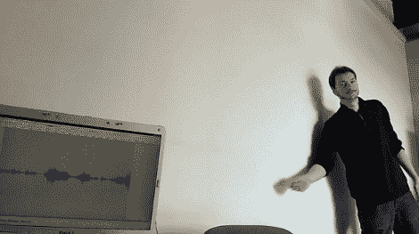

# 用基于敲击的家庭自动化控制器重新发明拍板

> 原文：<https://hackaday.com/2012/03/08/reinventing-the-clapper-with-a-knock-based-home-automation-controller/>

鼓掌吧！…鼓掌！…当 Clapper 在 80 年代中期问世时，它是超级棒的。现在[马修·斯蒂芬]正试图使这个概念更加实用。他组装了一个控制器，可以让你通过触摸墙壁来控制房子周围的东西。它被称为 Toktoktok 项目，使用小盒子来接收用户输入和控制灯和计算机等物品。

压电元件拾取用户发出的噪音。上图[Mathieu]展示了这种元件的灵敏度，它可以检测到墙壁上任何地方的刮擦声和敲击声，并在电脑显示器上以波形显示出来。对这些噪音进行巧妙的处理和过滤，可以让设备将它们转换成不同的命令。休息之后，他在视频中讲述了所有这些内容，然后演示了一系列功能，例如只需轻敲咖啡桌，就可以从电脑上唤醒并开始音频播放。

这不是我们第一次看到这个概念。我们最喜欢的一个是[这种门锁，它能听到秘密的敲门声](http://hackaday.com/2009/11/04/knock-detecting-lock/)。但是[Mathieu]正试图扩展其功能，并将其推向更广泛的市场。【维梅奥 http://vimeo.com/37957520 w = 470】T2