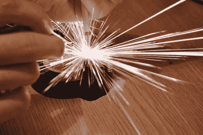

# 电容放电焊接机/切割机，满足您所有的轻质需求

> 原文：<https://hackaday.com/2012/03/09/a-capacitive-discharge-weldercutter-for-all-your-lightweight-needs/>

[Radu Motisan]写来分享他最近正在做的一个很酷的项目，[一个脉冲微点焊机/切割机。](http://www.pocketmagic.net/?p=2518)

每当[Radu]按下触发按钮时，通过在两个电极之间发送一对高电流脉冲，该设备能够点焊薄金属，如箔片和电池片。他的设备的切割部分使用相同的一般机制，尽管它需要更多的脉冲来完成工作。

焊接/切割过程由 ATMega16 控制，atmega 16 还负责接收用户输入并在 LCD 面板上显示信息。微控制器为焊接和切割产生快速(在十到几百微秒范围内)脉冲，后者显然需要一长串脉冲。

[Radu]开始使用相对较小的电容器阵列为设备供电，但最近升级到了 1.6 法拉的汽车音频电容器，其工作(和外观)比以前好得多。他的博客似乎每隔几天就会更新更多关于他的焊接站的图片和细节，所以一定要经常回来查看更新。

一定要留下来看看[Radu]给电池添加金属标签并用他的刀具撕开铝罐的短片。

 <https://www.youtube.com/embed/BVj0Tey3SSM?version=3&rel=1&showsearch=0&showinfo=1&iv_load_policy=1&fs=1&hl=en-US&autohide=2&wmode=transparent>

 </body> </html>