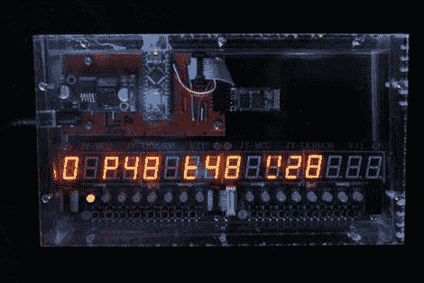

# 无线太阳能热水器控制器保证每次都有热水

> 原文：<https://hackaday.com/2012/03/09/wireless-solar-water-heater-controller-ensures-hot-water-every-time/>

[Peter Sobey]在家里安装了一个太阳能热水器，这个热水器一直工作得很好，直到他把厨房搬到了隔壁房间。现在离水箱有一段距离了，由于新加热器中增加的距离和温度限制混合阀，到达他的水槽的热水最多是温热的。

他安装了一个回收的太阳能电池板和水箱，专门用于他的厨房，但由于电池板位于水箱上方，他必须找到一种方法来主动监测和控制水温。他的泵和阀门系统最初是由一个现成的基于 PICAXE 的控制器驱动的，但[他最终有了一个冲动，想在组合中添加一个无线显示和控制面板。](http://members.optusnet.com.au/~psobey/SolarHotWaterSystem.htm)

现在，一对 Arduino Nanos 正在运行，其中一个位于泵控制器盒中，而另一个则用于他厨房的温度显示盒中。他使用一套蓝牙模块将 Arduinos 连接在一起，传递温度数据，并允许他在需要时发送泵控制器手动命令。

他说这个系统工作得很好，他对他的家酿控制器比他最初使用的那个更满意。