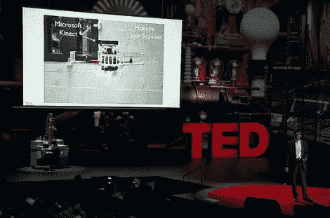

# [Vijay Kumar]关于四轴飞行器研究现状的 TED 演讲

> 原文：<https://hackaday.com/2012/03/09/vijay-kumars-ted-talk-on-the-state-of-quadcopter-research/>

[Vijay Kumar]是宾夕法尼亚大学的教授和 GRASP 实验室的主任，该实验室围绕自主四轴飞行器的研究取得了巨大成功。如果你对过去几年看到的视频演示感兴趣，你不会想错过最近关于该项目研究的 TED 演讲。几周前，当我们在一个音乐视频中介绍[一群机器人时，我们谈到了这一点，但关于这种类型的群体协作对前进意味着什么，还有很多需要了解。](http://hackaday.com/2012/03/04/quadrotor-squadron-plays-the-james-bond-theme-song-in-preparation-for-world-domination/)

我们总是想知道这项技术将走向何方，因为我们看到的所有实验都依赖于一系列高速摄像机来给群体中的每个机器人提供位置反馈。上图是 TED talk 视频中大约 12 分钟的截图(在休息后嵌入)。在这里 Kumar 博士]提出了超越这些相机的问题。投影屏幕上显示的四轴飞行器是一种可能的解决方案。它携带了 Kinect 深度相机和激光测距仪。这是一个测绘机器人，设计用于进入未知结构并创建环境的 3D 模型。

这一信息的好处是显而易见的，但这也给我们带来了另一种可能性。既然机器人被设计成一个自主的群体，那么它们能不能都配备摄像头，并为彼此组成位置反馈网格？请在评论区告诉我们你的想法。

[https://www.youtube.com/embed/4ErEBkj_3PY?version=3&rel=1&showsearch=0&showinfo=1&iv_load_policy=1&fs=1&hl=en-US&autohide=2&wmode=transparent](https://www.youtube.com/embed/4ErEBkj_3PY?version=3&rel=1&showsearch=0&showinfo=1&iv_load_policy=1&fs=1&hl=en-US&autohide=2&wmode=transparent)

[谢谢拉斯洛]