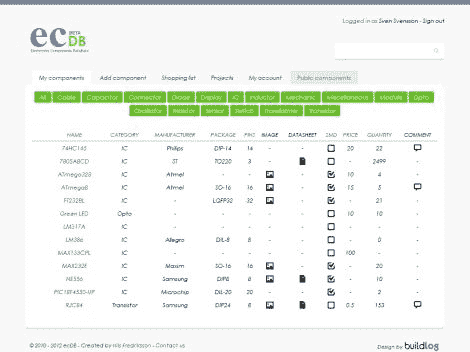

# EcDB 提供了一种简单、直观的方式来组织您的电子库存

> 原文：<https://hackaday.com/2012/03/12/ecdb-offers-a-simple-intuitive-way-to-keep-your-electronic-inventory-organized/>

对于任何黑客或制造者来说，最重要的工具之一就是组织。您可能认为它更多的是一个概念，而不是一个物理工具，但是不管您喜欢如何构建它，确保您的工具和组件总是(几乎)在它们应该在的地方是关键。随着零零碎碎的东西越来越多，有时很难准确地记住手头上有什么—[这就是 ecDB 派上用场的地方。](http://ecdb.net/about.php)

ecDB 是电子元件数据库的缩写，由[Nils Fredriksson]创建，它提供了一种清晰直观的方式来记录您的内部信息。我们中的许多人都使用电子表格和笔记本来做同样的事情，但 ecDB 允许您记录比任何一种解决方案都多得多的数据。

只要看一下网站的界面，这一点就很明显了。ecDB 不仅限于列出零件名称和数量，还允许您记录制造商信息、封装类型和引脚数，同时还允许您附加 PDF 数据表和元件图像。

我们真的很喜欢[Nils]组装起来的系统，并建议尝试一下，看看它是否能帮助你保持工作间的有序。