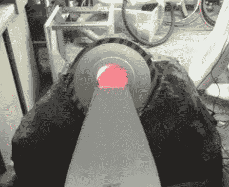

# 传送门迷你高尔夫球洞将焚化你的球…你这个怪物

> 原文：<https://hackaday.com/2012/03/12/portal-mini-golf-hole-will-incinerate-your-ball-you-monster/>

[Tom]的一个朋友很快就要过生日了，他被要求为此打一个迷你高尔夫球洞。虽然大多数人希望带啤酒或番石榴去狂欢，但他认为这是一个给生活带来一点点门户的机会。

在第一个传送门游戏接近尾声时，你被迫将你的同伴方块扔进焚化炉，这一幕[汤姆]认为是完美的迷你高尔夫球洞。他首先建造了一个虹膜门装置，用铁丝网和一些石膏将其包裹起来，制成了一个看起来很棒的垃圾处理管道。

他增加了一个通向洞的斜坡，然后[汤姆]开始忙于设备的电子部分。一旦按下坡道末端的入口按钮，Arduno 就会触发一对电机，打开垃圾处理门，点燃烟雾机。结果，正如你在下面的视频中看到的，简直棒极了。

[Tom]说他正在建造一对角楼和一个高尔夫球门户网站，所以如果你是一个门户网站的忠实粉丝，一定要查看他的网站更新。

[https://www.youtube.com/embed/Kv2W6nft96c?version=3&rel=1&showsearch=0&showinfo=1&iv_load_policy=1&fs=1&hl=en-US&autohide=2&wmode=transparent](https://www.youtube.com/embed/Kv2W6nft96c?version=3&rel=1&showsearch=0&showinfo=1&iv_load_policy=1&fs=1&hl=en-US&autohide=2&wmode=transparent)