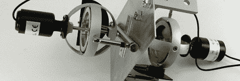

# 使用陀螺仪稳定功能避免相机晃动

> 原文：<https://hackaday.com/2012/03/13/avoid-shaky-camera-movements-with-gyroscopic-stabilization/>

就在“无论如何都不要编辑”之后，“摇晃的相机”是全世界 YouTube 观众的祸根。[大卫]想出了一个很好的解决方案来解决相机抖动的问题，使用陀螺仪来平衡制作一部伟大电影的颠簸。

大多数安装在移动框架上的摄像机——从 NFL 比赛中的滑索摄像机到警用直升机和空中侦察无人机——都有某种陀螺稳定功能。尽管陀螺稳定已经存在了 60 多年，但设计并没有太大变化。[大卫]找出了几项可追溯到 50 年代的专利，并着手复制这一设计。

[大卫]买了一对[格伦·特纳]的极其沉重且看起来昂贵的动力陀螺仪，并开始用螺栓将它们固定在一块金属板上。根据 1950 年的专利，陀螺仪以 90 度间隔安装，并用螺栓固定在相机上。

从视频演示(休息后)来看，在打开和关闭陀螺仪的情况下拍摄穿过停车场的漫步有明显的区别。虽然这对电机驱动的陀螺仪看起来有点笨拙，对我们的口味来说有点太大声，但这个解决方案比他构建的 1600 美元的专业陀螺仪便宜得多。

 <https://www.youtube.com/embed/Wh8-xxW1WgE?version=3&rel=1&showsearch=0&showinfo=1&iv_load_policy=1&fs=1&hl=en-US&autohide=2&wmode=transparent>

 </body> </html>