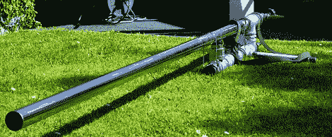

# 结束所有定位桩枪的定位桩枪

> 原文：<https://hackaday.com/2012/03/13/the-spud-gun-to-end-all-spud-guns/>

在北欧神话中，mjllnir 是雷神的锤子，在一场为阿斯加德众神创造最神奇和最慷慨的工具的比赛中被锻造。虽然我们不知道[克劳利先生]最近是否与洛基打了一个赌，但他版本的 mjllnir，一种由 MAPP 燃气提供动力的巨型 spud 枪，对我们的口味来说足够奇妙。

与我们见过的大多数[其他](http://hackaday.com/2011/06/16/antenna-cannon-for-amateur-radio/) [马铃薯](http://hackaday.com/2011/05/09/double-barreled-air-cannon/) [枪](http://hackaday.com/2011/04/09/bolt-action-pneumatic-spud-gun/)不同，【克劳利先生】在他的建造中避免使用 PVC 管和配件，因为那会在第一次试射时爆炸。相反，枪的大部分结构使用镀锌和不锈钢。这并不是说这种 spud 枪一定是安全的，尽管如此:正如他在休息后的视频中演示的那样，高尔夫球离开枪管时的能量与大多数步枪子弹相当。

关于点火系统，一个有趣的例子是，[MrCrowley]用一个无线门铃和一个 100 千伏的电击枪制作了一个远程点火系统。虽然这确实允许远程射击，但整个建筑看起来足够安全——至少从枪口后面——可以用步枪背带携带。

不言而喻的是*这是极其危险的*如果你不打算在临终遗言中说“想看些很酷的东西吗？拿着我的啤酒。”也就是说，[克劳利先生]知道他在做什么，你可以在休息后看看 mjllnir 的视频。

 <https://www.youtube.com/embed/ZkGriGwCSJU?version=3&rel=1&showsearch=0&showinfo=1&iv_load_policy=1&fs=1&hl=en-US&autohide=2&wmode=transparent>

 <iframe class="youtube-player" width="800" height="480" src="https://www.youtube.com/embed/edQx-9gMajk?version=3&amp;rel=1&amp;showsearch=0&amp;showinfo=1&amp;iv_load_policy=1&amp;fs=1&amp;hl=en-US&amp;autohide=2&amp;wmode=transparent" allowfullscreen="true" style="border:0;" sandbox="allow-scripts allow-same-origin allow-popups allow-presentation"/> </body> </html>