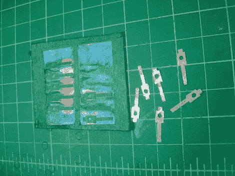

# 使用氯化铜“加工”铜零件

> 原文：<https://hackaday.com/2012/03/14/machining-copper-parts-using-cupric-chloride/>

一个朋友请本·阿德温帮忙修理一台旧发动机。它需要一套新刷子。它们只是安装在电机外壳上并接触换向器的薄铜片。这种金属太薄了，他想尝试通过溶解铜原料来制造替代品。

这不是覆铜板；PCB 中使用的原材料，具有覆铜玻璃纤维基板。它只是薄薄的铜片。[Ben]开始用油漆工的胶带覆盖顶部和底部。这将作为化学蚀刻剂的抗蚀剂。他走向激光切割机，去除零件轮廓周围的胶带。从那里它进入氯化铜大约两个小时。

蚀刻的部分边缘有点粗糙，所以他用锉刀手工清理。在给我们写信介绍这一过程时，他提出了一些改进建议。用于掩蔽的胶带不理想，他将尝试不同的方法。他还会减少零件周围的区域，以帮助加快加工速度。

作为一种家庭制作工具，这种技术变得越来越受欢迎。最近，我们看到蚀刻铜被用来制作外壳面板和时钟半透明模板。