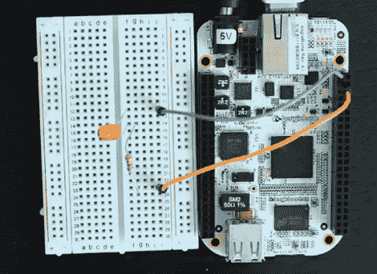

# 使用 BeagleBone 的嵌入式 Linux 摆弄 LED

> 原文：<https://hackaday.com/2012/03/15/twiddling-an-led-using-the-beaglebones-embedded-linux/>

如果你习惯于使用 8 位微控制器，那么迁移到运行嵌入式 Linux 的硬件平台上可能会有点令人畏惧。毕竟，在你和棋盘上的筹码之间有很多事情要做，就像上面看到的比格骨一样。但是[马特·理查森]向我们展示了找到这个设备上的针脚是多么容易。他从嵌入式 shell 中拼凑了[一个硬件控制的入门。](http://blog.makezine.com/2012/03/14/how-to-get-started-with-the-beaglebone/)

你会记得[猎兔犬骨是最新一代的猎兔犬板](http://hackaday.com/2011/11/01/say-hello-to-our-little-friend-the-beaglebone/)。ARM 处理器和其他好东西使它成为一个强大的工具，那些已经熟悉 Linux 的人将能够很快上手并运行。只需将该板连接到您的网络，并 SSH 到它开始。[Matt]在休息后的片段中概述了这一设置过程。然后，他点击参考手册，找到电路板两侧母接头的引脚排列。每个可用的 I/O 引脚都映射到/sys 目录，并且可以通过将您的命令回显到适当的文件来轻松控制。但是[Matt]走得更远，编写了自己的 Python 库，实现了 Arduino 风格的语法，如 digitalWrite()函数。

这个例子应该给你足够的动力，让你开始移植你自己的库来使用这个设备。别忘了记录你的项目，并[向我们透露这些项目](http://hackaday.com/contact-hack-a-day/)。T3

<https://www.youtube.com/embed/Y0uqRVxismQ?version=3&rel=1&showsearch=0&showinfo=1&iv_load_policy=1&fs=1&hl=en-US&autohide=2&wmode=transparent>

 
[谢谢马努]
 </body> </html>