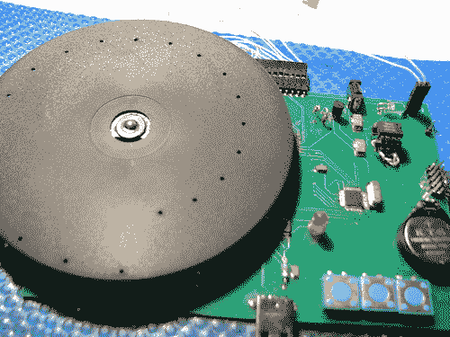

# 模拟时钟显示器使用尼普可夫圆盘

> 原文：<https://hackaday.com/2012/03/15/analog-clock-display-uses-a-nipkow-disk/>

虽然谢罗科伊对他的尼普可夫圆盘钟的结果并不兴奋，但是我们真的很享受。它利用视觉暂留的概念，从一个旋转的圆盘上产生一个光显示。

我们遇到过很多转盘钟。有几个是基于硬盘驱动器的盘片，[使用狭缝](http://hackaday.com/2009/09/07/hard-drive-rgb-clock/)或[系列狭缝](http://hackaday.com/2011/07/10/slick-16-segment-pov-hard-drive-clock/)来组成显示屏。这个[尼普可夫圆盘](http://en.wikipedia.org/wiki/Paul_Gottlieb_Nipkow#Nipkow_disk)使用了一种类似的技术，但是以一种更普遍的方式。当磁盘旋转时，以螺旋模式排列的一系列孔允许同心环的网格被用作像素。盘的底部用作显示区域。每个像素被下方的发光二极管在恰当的时间照亮，以便在观众的眼中定格该像素。演示有点粗糙，而且[Serokoy]提到球洞布局的精确度非常重要。他在一张喷成哑光黑色的 CD 上手工钻了这些孔。尽管他用电脑设计并打印了一个模板，但还是试了四次才找到合适的磁盘。

[谢谢斯沃夫斯基]