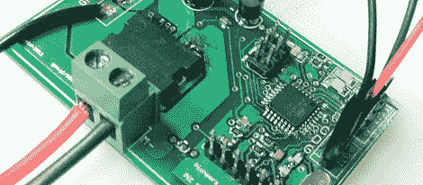

# 电机控制器也不 Nyan 猫

> 原文：<https://hackaday.com/2012/03/18/motor-controller-also-does-nyan-cat/>

作为加州大学伯克利分校的一名新生，[Keegan]一直在帮助学校的工程先锋项目，该项目为高中生提供一些工程原理的实践经验，通常是通过制造机器人。今年，【Keegan】的项目是一个[电机控制器](http://keeganmann.wordpress.com/2011/12/11/i2c-motor-controller-board/)，恰好[在电机 PWM 输出上播放 nyan cat song](http://www.youtube.com/watch?v=flp0m_UXWkE&amp;feature=related) 。

电机控制器旨在取代 PiE 团队目前使用的 Pololu [简单电机控制器](http://www.pololu.com/catalog/product/1372)。船上有一个 [H 桥芯片](http://cache.freescale.com/files/analog/doc/data_sheet/MC33887.pdf)和一个从 I2C 总线接受命令的 ATmega328。328 装载了 Arduino 引导程序，使得固件非常容易访问——这对将要构建和编程这些机器人的高中生来说是一件好事。

[Keegan]在 PiE Wiki 上为董事会[发布 Eagle 文件。现在，休息后请欣赏流行挞猫主题曲的美妙音调。](https://pioneers.berkeley.edu/wiki/Polar_Bear_Motor_Controller)

 <https://www.youtube.com/embed/flp0m_UXWkE?version=3&rel=1&showsearch=0&showinfo=1&iv_load_policy=1&fs=1&hl=en-US&autohide=2&wmode=transparent>

 </body> </html>