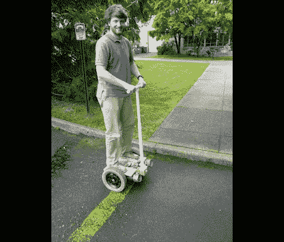

# 另一款自制赛格威克隆产品售价不到 300 美元

> 原文：<https://hackaday.com/2012/03/19/another-homebrew-segway-clone-comes-in-at-under-300/>

[马特·特纳]在一月份向我们透露了他的自制赛格威项目。不幸的是，这一信息被遗漏了，但我们很高兴他在阅读了周五的专题[一个不同的两轮平衡器](http://hackaday.com/2012/03/16/self-balancing-transport-is-arduino-controlled/)后发来了提醒。

我们喜欢他把这个项目称为一个年轻家庭的研究生的预算。我们当然理解他来自哪里，我们希望他能借此参加工作面试，向他们展示他是真正的工程师。控制电路比我们过去看到的要高端一些。他选择了 Cypress CY8C29466 SoC 来控制设备。但是传感器是一个常见的选择，使用 Wii Motion Plus 和 Wii Nunchuk 作为它们包含的陀螺仪和加速度计。这是显而易见的，因为传感器质量高，价格便宜，在当地就能买到，并且按照标准的 I2C 协议进行通信。

寻找发动机时，[Matt]很高兴在 Craig 的清单上找到了一台旧的电动轮椅。这也给了他一个齿轮箱，轮子和轮胎。他增加了一对电机驱动器，并自己做了修改以抑制反馈。听起来它们运行起来有点热，因为他计划在未来为它们添加冷却风扇。但是第一次迭代已经开始，并且运行得很好，正如你在休息后的视频中看到的。

[https://www.youtube.com/embed/rAZrFdnam3I?version=3&rel=1&showsearch=0&showinfo=1&iv_load_policy=1&fs=1&hl=en-US&autohide=2&wmode=transparent](https://www.youtube.com/embed/rAZrFdnam3I?version=3&rel=1&showsearch=0&showinfo=1&iv_load_policy=1&fs=1&hl=en-US&autohide=2&wmode=transparent)