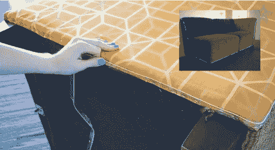

# 派对沙发上的电线管道

> 原文：<https://hackaday.com/2012/03/19/el-wire-piping-on-a-party-couch/>

如果你一直在推迟那个重新组装的项目，这里有一点激励让你开始。Adafruit 现在有一些电致发光电线，非常适合用作管道。他们[用发光材料](http://www.adafruit.com/blog/2012/03/19/how-to-el-wire-couch-video/)装备了一个小沙发，我们认为不管打开与否，它看起来都很棒。

安装过程真的很简单。EL 导线覆盖有透明材料，该材料提供了沿导线长度延伸的连续标签。这可以像你在上面的图片中看到的那样被钉上，或者被缝进织物缝里。所以你可以拿一个现有的沙发套，去掉所有的缝线，用 EL 线把它缝回去，代替原来的管道。休息后的视频展示了这个过程是多么简单。

这将是对我们一直想要构建的蠢朋克表的一个很好的补充。T3

<https://www.youtube.com/embed/7si_73v31I0?version=3&rel=1&showsearch=0&showinfo=1&iv_load_policy=1&fs=1&hl=en-US&autohide=2&wmode=transparent>

 </body> </html>