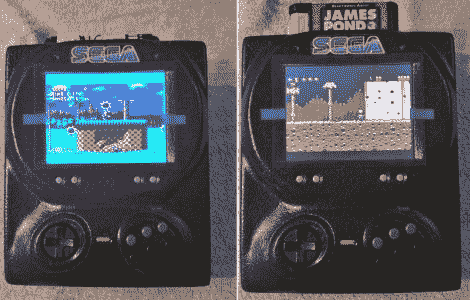

# 当控制台改装者对峙时，只有好事发生

> 原文：<https://hackaday.com/2012/03/20/when-console-modders-face-off-only-good-things-happen/>

我们真的很喜欢友好竞争导致优秀黑客的时候。不久前，我们向你展示了[一台由主机黑客【唐宁】组装的制作精美的世嘉 Genesis 便携版](http://hackaday.com/2012/03/11/geneboy-is-the-portable-sega-genesis-youve-always-wanted/)，他向黑客伙伴【邪恶点头】发起了挑战。这两个人为了个人用途黑进了世嘉游戏机，[唐宁的]而[邪恶点头]则在受委托制作。

正如你可能已经猜到的，[唐宁]第一个完成，但这并不意味着[邪恶点头]控制台是什么，但壮观。他的 Sega Multi Gen 是一款便携式 Genesis 游戏机，经过改装可以玩 NTSC 和 PAL 游戏。它拥有一个 5 英寸的大 PSOne 屏幕，以及来自官方 6 按钮 Genesis 游戏手柄的勇气。表壳由[唐宁]真空成型，是他精湛工艺的又一例证。控制台看起来就像是把控制器融在了它的脸上——这种设计肯定会给你一种坐在电视机前敲击按钮的真实感觉。

看看下面的视频，看看[邪恶点头]在把游戏机送给新主人之前整理的拆箱视频。

 <https://www.youtube.com/embed/P2J275vrjyo?version=3&rel=1&showsearch=0&showinfo=1&iv_load_policy=1&fs=1&hl=en-US&autohide=2&wmode=transparent>

 </body> </html>