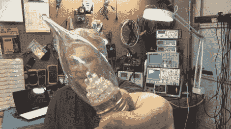

# 拆除有故障的 led 灯泡

> 原文：<https://hackaday.com/2012/03/20/tearing-down-a-failed-led-bulb/>

[Todd Harrison]正在考虑用 LED 灯替换他家里的一些白炽灯泡，所以他和他的妻子挑选了一个烛台灯泡进行测试，然后他们花了钱把它们全部换掉。灯泡在大约一周的时间内就坏掉了，所以[托德]拿出了他值得信赖的电子拆卸装置(他的锤子)，和我们分享了他的验尸报告。

粗略地看了一下后，[托德]发现给灯泡供电的电路并不复杂。一个小型桥式整流器以及几个电容和电阻是用来给该设备供电的，这使得它的故障有点令人费解。当[托德]把它接到电源上时，灯泡亮了，让他大吃一惊。他对其死亡原因的最佳猜测是，PCB 周围的收缩包装导致了短路，尽管他也注意到桥式整流器的一条腿没有焊接好。

他开始用灯来寻找更多的信息，但在这个过程中，他成功地烧坏了一些发光二极管。总的来说，LED 照明交换是令人失望的，但至少他一路上有一些乐趣！

如果你有兴趣看到完整的[托德的]诊断，请继续阅读。

[https://www.youtube.com/embed/kDVkCcBK2cE?version=3&rel=1&showsearch=0&showinfo=1&iv_load_policy=1&fs=1&hl=en-US&autohide=2&wmode=transparent](https://www.youtube.com/embed/kDVkCcBK2cE?version=3&rel=1&showsearch=0&showinfo=1&iv_load_policy=1&fs=1&hl=en-US&autohide=2&wmode=transparent)