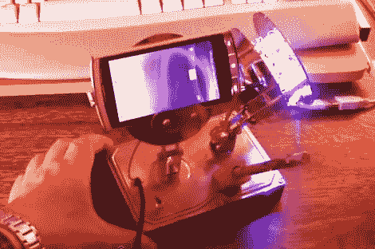

# 死硬盘智能手机支架仍然持有秘密数据

> 原文：<https://hackaday.com/2012/03/21/dead-hdd-smartphone-stand-still-holds-secret-data/>

我们实际上有几个死硬盘正在积灰，所以当我们听到一个项目找到了一个用途时，我们就会振作起来。但当我们发现这是一个集智能手机支架、笔筒和 LED 灯于一体的产品时，我们有些失望。我们只是不需要这种三重任务的人。但是等等…死灵有一个秘密。如果您知道如何在内启用驱动器，它仍可用作数据存储。

正如你所看到的，[Samimiy]删除了所有的硬盘驱动器的内脏，重新利用了盘片和安装支架作为手机支架，以及安装几把 led 的安装板。灯具部分可以调节，这要归功于他零件箱里的一个小台灯的铰接底座。该设备从您在右上角看到的 USB 连接器接收电源。这就是秘密的第一部分。这不仅仅是供电，它还提供了与隐藏在硬盘盒内的拇指驱动器的 USB 连接。但是仅仅把它连接到你的电脑上并不能挂载它。[Samimy]从一个自动夜灯上取下光传感器，把它安装在笔筒下面。如果你用手电筒照下那块木头上的洞，它会将电力传送到秘密的 USB 驱动器，导致它在你的系统上枚举。相当聪明！休息之后看看他的视频。

我们想知道是否有办法将这种基于光的锁系统整合到安装在鼠标上的拇指驱动器中。

[https://www.youtube.com/embed/4UaylHzq9GQ?version=3&rel=1&showsearch=0&showinfo=1&iv_load_policy=1&fs=1&hl=en-US&autohide=2&wmode=transparent](https://www.youtube.com/embed/4UaylHzq9GQ?version=3&rel=1&showsearch=0&showinfo=1&iv_load_policy=1&fs=1&hl=en-US&autohide=2&wmode=transparent)