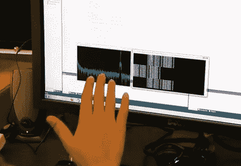

# 多普勒效应可以让你在电脑上添加手势

> 原文：<https://hackaday.com/2012/03/21/doppler-effect-lets-you-add-gestures-to-your-computer/>

如果您可以在不更改任何硬件的情况下将手势识别添加到您的计算机中，会怎么样？这个研究项目寻求使用电脑麦克风和扬声器来识别手势。音频通过扬声器播放，来自麦克风的输入经过处理以检测多普勒频移。通过这种方式，它可以检测你的手的运动(或任何反射声音的物体的运动)。

声音输出在 22-80 kHz 的范围内，我们的耳朵听不到。这确实让我们想知道这种技术的广泛使用是否会让宠物数量疯狂，或者改变野生动物的迁徙路线，但这是另一天的研究。该系统甚至可以在播放声音的同时使用，因此您不会失去听音乐或看视频的能力。

上面的屏幕显示了应用程序的原始输出。但是在休息后的视频中你可以看到一些可能的用途。它可以滚动页面，双击(或者可以说是双击)，还有一个功能可以检测到用户离开电脑并自动锁定屏幕。

[西汉特·古普塔]是整理视频的研究员。除了这个项目(称为声波)，他的研究页面上还有其他几个有趣的替代输入项目[。T3

<https://www.youtube.com/embed/wK_u8-UQmOs?version=3&rel=1&showsearch=0&showinfo=1&iv_load_policy=1&fs=1&hl=en-US&autohide=2&wmode=transparent>

</a>
 
[谢谢丹]
 </body> </html>](http://www.cs.washington.edu/homes/sidhant/research.html)