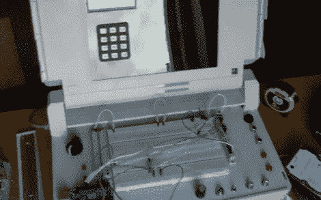

# 古老的笔记本电脑被赋予新的生命，成为移动原型平台

> 原文：<https://hackaday.com/2012/03/22/ancient-laptop-given-new-life-as-mobile-prototyping-platform/>

你能用一台坏掉的康柏 SLT 286 做什么？它公文包般的大小和形状实际上使[成为一个非常有趣的便携式电子原型站](http://www.youtube.com/watch?v=C7jp4Ztcu8M)。[Philip]去掉了组件，开始添加他在开发项目时最常用的项目。

休息之后，他分享了视频中的所有细节。在舞台中央是一个双试验板，键盘通常会出现在那里。上图中很难辨认，但有一组端子板垂直分布在这些试验板的两侧。每个端子都连接到外设或电源/接地总线。左边的黑色旋钮让他调整可变电压调节器的输出。右下角有一个旋转编码器、按钮、拨动开关和几个电位计。这些，连同小键盘和字符显示器(安装在屏幕原来的位置)和 DB 连接器(在外壳的背面)，它们的引脚映射到右边的端子板。[Philip]在左下方的区域安装了一个 Arduino Uno，但我们确信很容易更换成他需要的任何分线板。

回答视频中菲利普的对话:不，这不是最糟糕的演示。我们认为你在展示所有功能方面做得很好。就原型而言，松散的连接是正常的。

 <https://www.youtube.com/embed/C7jp4Ztcu8M?version=3&rel=1&showsearch=0&showinfo=1&iv_load_policy=1&fs=1&hl=en-US&autohide=2&wmode=transparent>

 </body> </html>