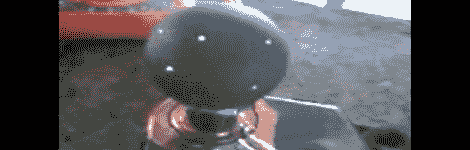

# 婴儿的第一台星光投影仪和一个箔滑环

> 原文：<https://hackaday.com/2012/03/22/babys-first-star-light-projector-and-a-foil-slip-ring/>

对于一个新生儿来说，一切都是神奇的；缺乏对象持久性意味着一切都是新的、美妙的、新奇的。那么，有什么能比环绕婴儿房间的投影星域更好，温柔地送他们入睡呢？

【皮特】的灵感来自于[这台早期的星光投影仪](http://hackaday.com/2012/02/19/bringing-the-stars-to-your-baby/)，它将一个旋转的星域投射到一个托儿所的墙壁和天花板上。[皮特]使用了一个安静的 12 伏齿轮马达，以每分钟 5 转的速度旋转星域，而不是一个相当响亮的伺服系统。像以前的版本一样，使用了 LED，但[Pete]发现了一种可以自动变色的 RGB LED。

[皮特]的齿轮马达的轴很小，不像伺服系统，它会不停地旋转。这意味着需要一个滑环来将电流传递到旋转的球体中。一片铜箔和一对临时制作的刷子就足够了。虽然[皮特]的项目，像它的前任一样，似乎没有任何公认的星座钻入球体，但箔滑环开辟了一种可能性，即在球体内部安装一个带闪光灯的小型微控制器。

休息之后，请观看[Pete]的内置动作视频。

[https://www.youtube.com/embed/bhB0vsh-BeI?version=3&rel=1&showsearch=0&showinfo=1&iv_load_policy=1&fs=1&hl=en-US&autohide=2&wmode=transparent](https://www.youtube.com/embed/bhB0vsh-BeI?version=3&rel=1&showsearch=0&showinfo=1&iv_load_policy=1&fs=1&hl=en-US&autohide=2&wmode=transparent)