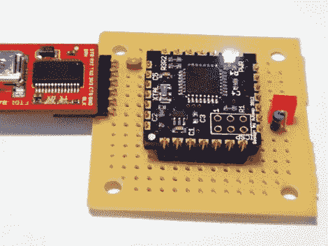

# SMDuino 帮助 Arduino 适应狭窄的地方

> 原文：<https://hackaday.com/2012/03/23/smduino-helps-arduino-fit-into-tight-places/>

[Adam]厌倦了在基于 Arduino 的设计中一遍又一遍地重复相同的组件。他利用周末的部分时间设计了一个小型电路板，可以容纳他需要的一切，并可以作为未来所有项目的一个单独组件来构建。上面你可以看到他称之为 [SMDuino 的项目，一个可以用作表面贴装部件](http://code.google.com/p/smduino/)的 Arduino 克隆。

电路板四边的触点断开引脚。它们的设计间距为 0.1 英寸，这意味着它们可以与标准引脚接头配合使用。但由于它们是从上到下镀通的，因此也很容易焊接到表面贴装焊盘上。这个项目是开源的，所以你可以订购你自己的主板(他用的是呆子 PDX ),或者发邮件给他，如果你想预订的话。这仅适用于未组装的多氯联苯。但是这里使用的组件很少，所以组装起来非常便宜。您需要四个电容、四个电阻、一个晶体、一个 LED、您选择的 ATmega*8(这里使用的是 ATmega328)和一个低压差稳压器。当然，没有晶体振荡器也是可能的。

这是否让其他人想起了基本邮票 2？