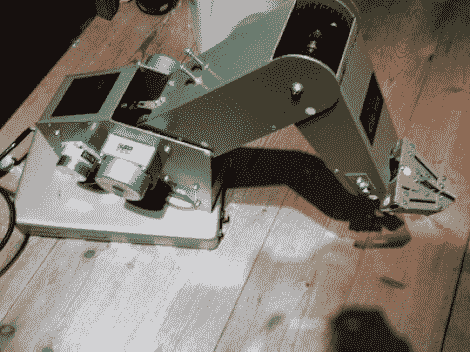

# 给旧机械臂添加语音控制

> 原文：<https://hackaday.com/2012/03/23/adding-speech-control-to-an-old-robotic-arm/>

[Joris Laurenssen]已经挂在这个机械臂上大约 20 年了。他最近的项目使用一些熟悉的工具为手臂的每个关节添加语音控制。

该臂有自己的控制器，通过 DB-25 端口连接。[Joris']第一个任务是找出通过连接发送的是什么类型的命令。他做了一些测试，以确定信号的水平，然后连接上他的 Arduino，让它读出通过标准并行连接传来的值。这让他很快建立了简单的 ASCII 字符语法，用于命令设备移动。只有八个命令集，而且很容易就能画出草图来驱动这个设备。

该项目的第二部分是使用语音命令将这些并行信号推送到手臂上。他决定使用 Android 手机的语音识别功能，而不是重新发明轮子。他使用 Android (SL4A)的[脚本层和一个 Python 脚本来解释命令，通过 Telnet 将命令推送到他的计算机，最终驱动手臂。休息之后我们嵌入了视频演示。他用荷兰语下命令，但用英语加上评论，这样你就能知道发生了什么。](http://code.google.com/p/android-scripting/)

[https://www.youtube.com/embed/RaUX5g0on90?version=3&rel=1&showsearch=0&showinfo=1&iv_load_policy=1&fs=1&hl=en-US&autohide=2&wmode=transparent](https://www.youtube.com/embed/RaUX5g0on90?version=3&rel=1&showsearch=0&showinfo=1&iv_load_policy=1&fs=1&hl=en-US&autohide=2&wmode=transparent)