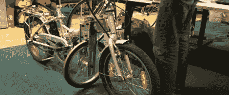

# 自稳定自主自行车

> 原文：<https://hackaday.com/2012/03/25/self-stabilizing-autonomous-bicycle/>

对于[Gunnar]的毕业论文，他想制造一辆自主自行车。然而，这个想法有一个明显的问题:机器人自行车到底是如何直立的？他平衡自行车的解决方案是一个反作用轮，使自行车一直保持直立。

自行车基本上是一个倒立摆；我们已经看到在[一些](http://hackaday.com/2010/11/27/balancing-inverted-pendulums/) [项目](http://hackaday.com/2010/04/30/ball-inverted-pendulum/)中控制的东西。为了平衡他的无人驾驶自行车，[Gunnar]使用了一个稳定轮和一个 IMU 来确保自行车始终处于直立位置。自行车测量自身的倾斜和角速度，以及稳定轮的速度。为了校正向左倾斜，稳定轮顺时针旋转，并通过逆时针旋转来校正向右倾斜。

虽然[Gunnar]的自行车车轮用作陀螺仪的解决方案很聪明——它使用普通的自行车车轮，如果有人想复制这个项目，可以大大降低成本——但离地间隙并不大。稳定轮的尺寸可以通过用钨、锇或铅盘代替 7.4 千克的钢轮来减小，可能变得很小，可以放入框架内。尽管如此，一个非常好的建筑肯定会吸引一些人。

 <https://www.youtube.com/embed/EAhQyBLxgu4?version=3&rel=1&showsearch=0&showinfo=1&iv_load_policy=1&fs=1&hl=en-US&autohide=2&wmode=transparent>

 </body> </html>