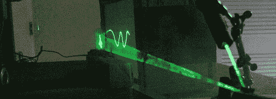

# [迪诺]为期一年的盛事是一台激光示波器

> 原文：<https://hackaday.com/2012/03/26/dinos-one-year-extravaganza-is-a-laser-oscillograph/>

Hackaday 的读者可能已经注意到了《Hack A Week》的迪诺·塞戈维斯(Dino Segovis)在过去七天里制作的每周帖子。为了[迪诺]的一周年纪念日，他使出浑身解数，整理出了他迄今为止最酷的一个黑客。这是一台激光示波器，像示波器一样在屏幕上投射波形。更重要的是，整个装置是由一个废弃的硬盘和一些马达和镜子组成的。

构建使用一个旧的硬盘驱动器来绘制波形的垂直分量。因为硬盘通常使用音圈来移动磁头，所以将硬盘直接连接到[Dino]笔记本电脑的耳机输出非常容易。在他的电脑上播放一个正弦波可以使驱动器的磁头上下移动，但是[迪诺]还有另外一个维度。为此，他使用了一个旋转镜，将波反射到一个纸屏幕上。

[Dino]的成品与示波器或投影电视没有太大区别。[迪诺]有可能在他的基础上进行改进，通过增加额外的电子设备和光学设备来制作真正的矢量显示器，但我们预计至少在两周年之前不会这样做。

休息之后看看[Dino]的构建视频。

 <https://www.youtube.com/embed/yEXxJ3toHqs?version=3&rel=1&showsearch=0&showinfo=1&iv_load_policy=1&fs=1&hl=en-US&autohide=2&wmode=transparent>

 </body> </html>