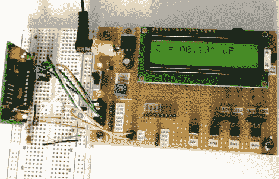

# 通过制作这款电表来加深您对电容器的理解

> 原文：<https://hackaday.com/2012/03/27/polish-your-understanding-of-capacitors-by-building-this-meter/>

制作电容计是一个很好的练习。如果你在只有数字电路的生活中感到非常安全，这将让你走出舒适区，明白在设计中加入模拟电路没有什么可担心的。这里，【Raj】[比较分压器和 RC 定时器来计算电容器](http://embedded-lab.com/blog/?p=4400)的值。该项目旨在教授概念，对于至少有一点可编程微控制器工作经验的人来说，很容易理解。

该电表基于一个已建立的等式，该等式使用起始电压和终止电压以及两者之间转换所需的时间来计算电容。电容器将从 0 伏充电到 0.5 伏。使用内置模拟比较器是最简单的方法。[Raj]对一个分压器进行了试验，以在比较器的一个引脚上建立 0.5V 基准电压。另一个输入来自一个电路，该电路将一个电阻与被测电容串联。当读数超过 0.5 伏参考电压时，比较器匹配将被触发，停止在充电周期中运行的计时器。从那以后，只是在计算中使用定时器值的问题。