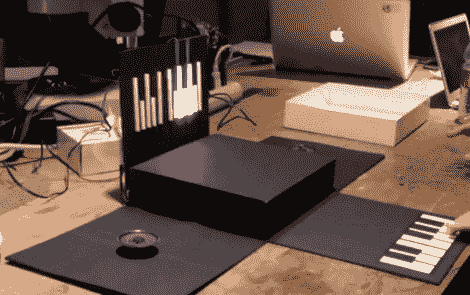

# 钢琴盒是一个纸做的数字合成器

> 原文：<https://hackaday.com/2012/03/27/piano-box-is-a-digital-synthesizer-made-of-paper/>

我们喜欢这架纸艺钢琴的外观，它是[Catarina]和纽约电阻器公司的一些朋友一起制作的，纽约电阻器公司是纽约市的一个黑客空间。它开始是一个白色顶的立方体黑匣子。但是只要像卡塔琳娜在广告之后的视频中所做的那样提起顶部，三个侧面就会变平，露出一对扬声器和一个单八度键盘。

按键的时候不要动。相反，她决定使用[cap sense Arduino 库](http://hackaday.com/2011/11/21/simple-touch-sensors-with-the-arduino-capsense-library/)来实现触摸感应键。每个按键都由一个平面的铜箔胶带组成，一条胶带延伸到盒子的中心，在那里它与隐藏在那里的 Arduino Mega 接口。音调库产生由扬声器播放的波形，当您按下每个键时，盒子直立侧的一组 led 照亮键盘图。您可以看到显示屏上有一些短白条，对应于键盘上的黑键。

如果你看一下代码，你会发现这些库真的让项目的代码变得简单了。

 <https://www.youtube.com/embed/FFA44-gTNIM?version=3&rel=1&showsearch=0&showinfo=1&iv_load_policy=1&fs=1&hl=en-US&autohide=2&wmode=transparent>

 
[谢谢埃里克]
 </body> </html>