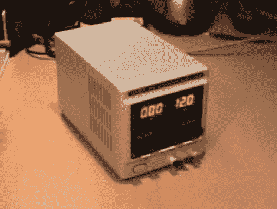

# 安静廉价的台式电源

> 原文：<https://hackaday.com/2012/03/29/quieting-an-inexpensive-bench-power-supply/>

[Mike]刚刚花了大约 80 美元购买了 Atten APS3005S 台式电源。它确实起作用了，但是它太吵了！休息过后，我们非常惊讶地听到它在视频中被点燃。更糟糕的是，由于风扇从未关闭，噪音一直存在。在与其他工作台供应商合作后，他知道许多型号都有一个共同特点，那就是温控机箱风扇。他着手[关闭风扇，并实施温度开关](http://www.youtube.com/watch?v=-lq1YGAgJ0c)。

在这个项目中,[Mike]有幸看到了一个几乎相同的模型，该模型具有温度切换功能。他发现，这款产品的电路板上安装了一个通孔零欧姆电阻来代替恒温开关。该开关在 45 摄氏度或以上时关闭连接，从而打开冷却风扇。用零欧姆电阻桥接走线以节省生产成本是导致风扇持续运转的原因。在用 KSD-01F 替换了电阻器并用高质量的版本替换了库存风扇之后,[Mike]已经将一个噪声生成器变成了一个对耳朵友好的设备。

 <https://www.youtube.com/embed/-lq1YGAgJ0c?version=3&rel=1&showsearch=0&showinfo=1&iv_load_policy=1&fs=1&hl=en-US&autohide=2&wmode=transparent>

 </body> </html>