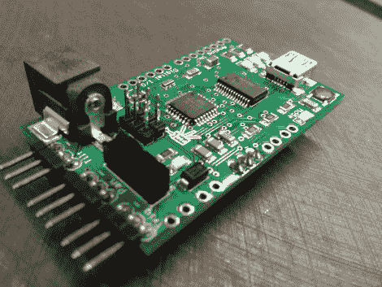
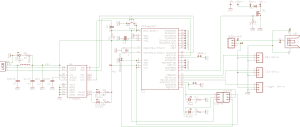

# 哨兵枪控制器-电路板升级

> 原文：<https://hackaday.com/2012/03/29/sentry-gun-controller-board-upgrade/>

这个开源的哨兵枪控制器板通过去除 Arduino 板建立在一个伟大的概念上。以前的版本是一个 Arduino shield，但这次升级通过将必要的部件整合到一个更小的尺寸中，保留了所有很酷的功能。

上面的图片没有很好地传达出项目的范围。去看一看[去年的特色，它使用了控制器](http://hackaday.com/2011/03/22/autonomous-paintball-sentry-gun-2/)的屏蔽版本。该建筑使用伺服安装彩弹枪结合网络摄像头。您仍然可以构建相同的平台，但是使用开源文件来包含这个板。它有三个伺服电机的输出，也可以与气枪或彩弹枪接口，气枪或彩弹枪有自己的电子触发器和集成电池。

我们总是喜欢看到像这样的项目的示意图。为了您的方便，我们从 Eagle 包中导出了一个图像。休息之后，你可以找到它，还有演示视频。

[https://www.youtube.com/embed/qdBASlWQTaQ?version=3&rel=1&showsearch=0&showinfo=1&iv_load_policy=1&fs=1&hl=en-US&autohide=2&wmode=transparent](https://www.youtube.com/embed/qdBASlWQTaQ?version=3&rel=1&showsearch=0&showinfo=1&iv_load_policy=1&fs=1&hl=en-US&autohide=2&wmode=transparent)

[via [被黑的小工具](http://hackedgadgets.com/2012/03/26/open-source-hardware-sentry-gun-controller/)