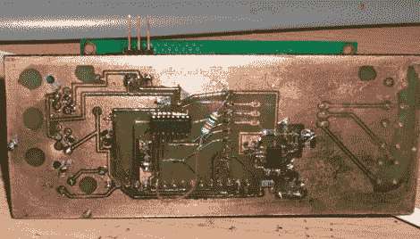

# 带 LCD 的单线局域网

> 原文：<https://hackaday.com/2010/03/23/1-wire-lan-with-an-lcd/>

[Viktor]，我们最喜欢的狂热黑客之一，这个月一直在玩单线系统。最初的 MicroLAN Fonera 已经变成了一个 [iButton 接口](http://hackaday.com/2009/07/09/hacking-an-ibutton/)，一个单线[供电的集线器](http://www.karosium.com/2010/03/fonera-1-wire-continued-hub.html)，最后是一个单线[字符驱动的 LCD](http://www.karosium.com/2010/03/fonera-1-wire-continued-display.html) 。任何关注单线系统或 OWFS 的人肯定会从他的测试中受益。

然而，如果你仍然没有得到单线的好处，让我们提醒你单线 [HVAC](http://hackaday.com/2009/07/29/1-wire-hvac-monitoring-system/) 和 [IPv6 到单线协议转换器](http://hackaday.com/2009/12/02/ipv6-to-1-wire-protocol-translator/)。

[谢谢胡安]