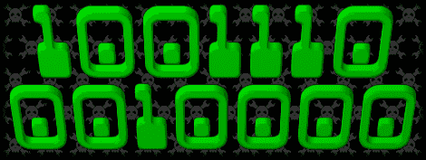

# 10，000 个职位

> 原文：<https://hackaday.com/2012/03/30/10000-posts/>

根据我们 CMS 的计算(我们使用 WordPress)，这是 Hackaday 发表的第一万篇帖子。我们打算[建造一个五彩纸屑炮](http://hackaday.com/2010/11/08/build-a-confetti-cannon-for-your-next-party/)，但是我们太忙于寻找有趣的项目，以至于每天都要出现多次。

我们要感谢每一个记录他们项目的人，他们与世界各地的黑客生态系统分享了他们在地下室、车库或黑客空间的所作所为。我们希望每次你发布一个构建日志或者项目总结的时候，你能考虑给我们发一个链接。我们也感谢那些发现有趣的博客或论坛帖子并提交建议的人，尽管这不是他们的项目(我们全心全意地鼓励)。

我们的投稿人和编辑值得称赞。多年来，越来越多的 Hackday 校友帮助 hack day 的首页成为一个你可以指望的有趣用途的地方，否则每天的事情。你听说过他们的很多名字，比如[菲利普·托伦]、[艾略特·菲利普斯]和[凯勒·克拉夫特]。但是你在首页上看到的大部分内容都是作者筛选技巧和浏览 RSS 提要清单以发现新的有趣的项目和项目想法的结果。他们的贡献是保持首页新鲜和新的，但我们继续在我们的帖子中使用皇家“我们”，因为它是最重要的项目。

最后，我们感谢普通读者，他们的参与让灯一直亮着，他们的评论建立了一个社区。许多人开始是潜伏者，受到这里介绍的项目的启发，直到他们采取行动，亮出他们的第一个 LED。每篇文章评论部分的线索都是进化的软泥，通常会导致下一个惊人的构建。继续阅读，继续建设性地评论，当我们用 1 填充这些数字时，我们会在我们的第 16，383 篇帖子中看到你们。

谢谢你。