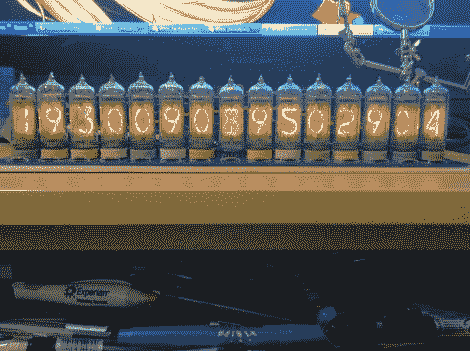

# 15 位谢妮时钟包含大部分无用信息

> 原文：<https://hackaday.com/2011/04/06/15-digit-nixie-clock-contains-mostly-non-useful-information/>

[Jarek Lupinski]再次尝试，这次他用 15 根谢妮管建造了一个时钟。只要看看时间…等等，你现在怎么看这个？这不是大时代以来的第二次，而是向一件非常昂贵的纽约市艺术品致敬。[Jarek]从联合广场的[节拍器艺术装置](http://en.wikipedia.org/wiki/Metronome_%28public_artwork%29)中获得灵感。

我们之前从未听说过这件艺术品，当得知这件艺术品的委托价格为 420 万美元时，我们感到非常震惊。它喷出蒸汽，用它神秘的 15 位数迷惑路人。似乎左边的八位数字标记了当前时间——两位数代表小时，两位数代表分钟，两位数代表秒，最后一位数字代表百分之一秒。剩下的七位数字倒计时一天的剩余时间。所以当你看的时候，你会看到显示器的有效数字在增加，而无效的一半在减少。

谢妮版本紧贴在一个 15 英寸×4 英寸的印刷电路板上。我们确信它不会以百万计，但是生产它不会便宜。每个电子管都有自己的驱动芯片，无需多路复用。ATmega168 控制时钟(以及一些移位寄存器来扩展 I/O 计数)，从 DS1307 RTC 芯片读取时间。看起来很花里胡哨，但是这个版本上的喷烟在哪里？