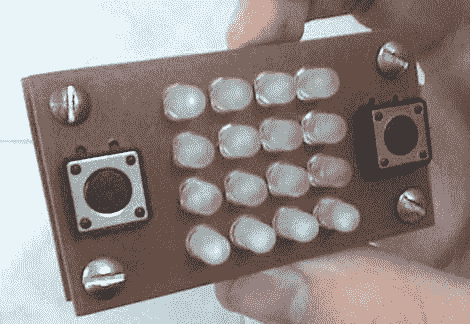

# 16 像素手持游戏

> 原文：<https://hackaday.com/2010/07/11/16-pixel-handheld-gaming/>

我们现在的手持设备需要的是更低的分辨率。休息后看看视频，看看[Bruno Pasquini] [4×4 LED 矩阵手持游戏](http://forums.modretro.com/viewtopic.php?f=3&t=3830&start=0)的精彩动作。该设备由 16 个双色 led、4 个按钮和 PIC 16F628 组成。还没有原理图，但看起来不需要移位寄存器，只需要一些晶体管来处理每种颜色的行的电流负载。我们已经看到了一款玩超级马里奥兄弟的 64 像素掌上电脑[，但是这款便携电脑带来了一款顶级的滚动赛车游戏，而它的显示屏尺寸只有 64 像素的 25%。](http://hackaday.com/2010/02/19/update-most-interesting-game-in-64-pixels/)

[https://www.youtube.com/embed/bilCpOhulCI?version=3&rel=1&showsearch=0&showinfo=1&iv_load_policy=1&fs=1&hl=en-US&autohide=2&wmode=transparent](https://www.youtube.com/embed/bilCpOhulCI?version=3&rel=1&showsearch=0&showinfo=1&iv_load_policy=1&fs=1&hl=en-US&autohide=2&wmode=transparent)

[谢谢迈克]