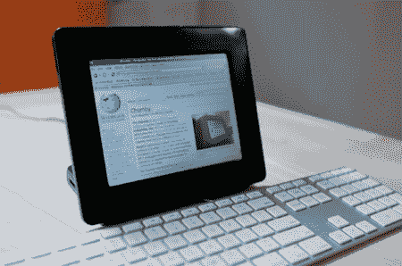

# 169 美元的 Linux 平板电脑

> 原文：<https://hackaday.com/2010/09/15/169-linux-tablet-sortof/>

Insignia Infocast 是一款 169 美元的简单媒体设备，在百思买销售。作为分享照片和运行 Chumby 应用程序的一种方式，[黑客们开始发布软件包来扩展它的功能](http://www.bunniestudios.com/blog/?p=1294)。[Bunnie]向我们展示了一个特别的包，它允许使用外部键盘作为 web 浏览器。有了 800Mhz 的处理器、800×600 的触摸屏和 2 GB 的内存，我们可以看到这只是可能实现的表面。[Bunnie]指出，一些人正在努力将 Android 移植到设备上，如果你真的想冒险，你可以[钻研硬件](http://files.chumby.com/bunnie/silvermoon_oem/silvermoon_OEM_ref_v3.pdf)。