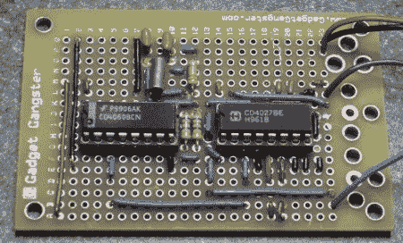

# 1Hz Timebase

> 原文：<https://hackaday.com/2011/05/19/1hz-timebase/>

看看这个简单的方法[实现 1Hz 时基](http://hackersbench.com/Projects/1Hz/)。这基本上是在电路中划分晶体频率以获得所需结果的一课。在这种情况下，他们从一个 32.768KHz 晶振开始，并对其进行分频。他没有像许多项目一样使用 NE555，而是选择了一个结果不容易随温度变化而漂移的方向。选择的方法是 CD4060 分频器，基本上只是一个触发器链。除法器离所需结果还差一步，因此必须增加一个额外的触发器。这是非常基础的东西，但也是一本很好的读物。他们详细介绍了这一切是如何工作的，以及为什么你会使用这种方法。

嘿，还记得那次我告诉你只用一个 1Hz 的晶体吗？是的，我们可以再笑一次。

[via [HackedGadgets](http://hackedgadgets.com/2011/05/14/diy-1hz-time-base/)