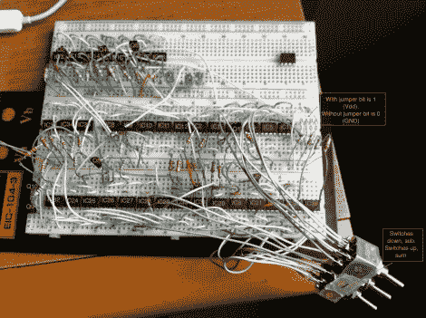
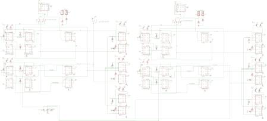

# 仅使用 36 个 555 定时器的 2 位全加器

> 原文：<https://hackaday.com/2011/02/28/2-bit-full-adder-using-just-thirty-six-555-timers/>

这个 [2 位加法器](http://cpu86.hackhut.com/2011/02/26/ne555-2bits-full-adder-and-subtractor/)需要大量的工作来构建。它总共使用了 36 个 555 定时器，并且可以选择加减数字。这是对该器件的一种非常规使用，更多地依赖芯片作为反相器，并利用了内置 NPN 晶体管的事实。[cpu86]确实使用了一些 PNP 晶体管，使他能够关闭一些 555，使一切正常工作。

他解释了二进制补码在减法功能中的使用，但这个过程只是很快地触及了一下。幸运的是，在他的项目报告中有一个巨大的 eagle 示意图，这样你就可以跟随并真正掌握这个东西是如何工作的。为了您的方便，我们已经生成了一个 PNG 并在休息后嵌入了它。你会发现它刚刚在两个视频设备的行动。

添加:

[https://www.youtube.com/embed/9Kh4aoMjkt8?version=3&rel=1&showsearch=0&showinfo=1&iv_load_policy=1&fs=1&hl=en-US&autohide=2&wmode=transparent](https://www.youtube.com/embed/9Kh4aoMjkt8?version=3&rel=1&showsearch=0&showinfo=1&iv_load_policy=1&fs=1&hl=en-US&autohide=2&wmode=transparent)

减去:

[https://www.youtube.com/embed/L-QBj1tZYIQ?version=3&rel=1&showsearch=0&showinfo=1&iv_load_policy=1&fs=1&hl=en-US&autohide=2&wmode=transparent](https://www.youtube.com/embed/L-QBj1tZYIQ?version=3&rel=1&showsearch=0&showinfo=1&iv_load_policy=1&fs=1&hl=en-US&autohide=2&wmode=transparent)

示意图:

[谢谢保罗]