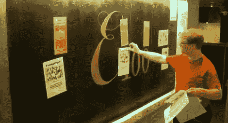

# 20 千伏电压取代了这个公告板上的图钉

> 原文：<https://hackaday.com/2011/11/10/20-kilovolts-replaces-push-pins-on-this-bulletin-board/>

电气工程师不需要图钉。那是因为他们知道如何控制电子！[斯文]在[建造他的高压公告板](http://donkey.vernier.se/~ghlargh/hvn/)时，将他对这些亚原子粒子的知识派上了用场。它使用一组垂直排列的电线将纸张固定在纸板上。电线在通过时有高电压和低电流。它们在电路板前面，但不接触电路板，电路板充当接地层。以这种方式，静电荷推动(或者应该是拉动？)靠在纸上，使每张纸都放在正确的位置。

在休息后的视频中，[斯文]让我们参观了这里的硬件工作。它从一个 12V psu 开始，为降压转换器供电。被调节的馈电被接入被设计成 CCFL 驱动器的高压电源。最后，使用倍压器来达到最终电压，测量每根电线约 20 千伏。

别担心，[斯文]说裸线是“几乎完全安全的”，因为传导的电流很小。

[https://www.youtube.com/embed/dwHZ2C7zDmo?version=3&rel=1&showsearch=0&showinfo=1&iv_load_policy=1&fs=1&hl=en-US&autohide=2&wmode=transparent](https://www.youtube.com/embed/dwHZ2C7zDmo?version=3&rel=1&showsearch=0&showinfo=1&iv_load_policy=1&fs=1&hl=en-US&autohide=2&wmode=transparent)