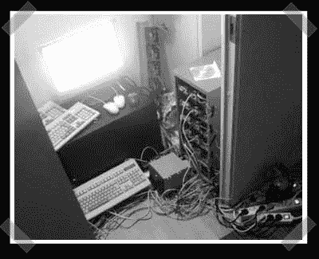

# 24 个核心宜家集群

> 原文：<https://hackaday.com/2008/04/23/24-core-ikea-cluster/>

【Janne】做自由动画，想要一个有[更多 CPU](http://www.yxx.se/helmer/) 的东西来完成他的渲染工作。他拿起一个宜家“Helmer”橱柜，将其改装成可以容纳六个英特尔四核处理器、六块 8GB 内存的 1gb 主板和六个 400 瓦电源。他似乎对此很满意——我认为它只需要一些定制的电源线和一个集成的 Gig-E 开关就可以达到完美。什么？我一点都不嫉妒。

*   [永久链接](http://www.yxx.se/helmer/)