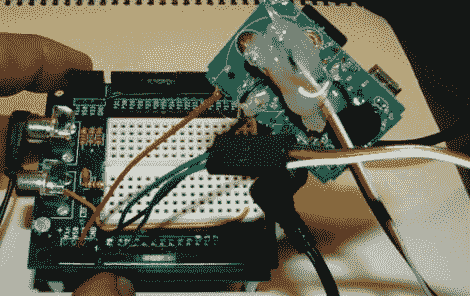

# 3 美元为你的项目增添了美妙的旋律

> 原文：<https://hackaday.com/2012/01/16/3-adds-sweet-tunes-to-your-project/>

这是一个设计自己的 MP3 播放器的有趣时间，可爱地添加功能到精心制作的用户界面。但有时你只是想用一种快速而廉价的方式将音乐添加到项目中。[Jeff Ledger]将向您展示如何使用一些来自海外的山寨硬件来实现这一点。他没有使用价格不菲的合适的分线板，而是使用了从易贝卖家那里以 3 美元购得的普通 MP3 播放器。

打开箱子，你会发现你实际上为你的华盛顿三重奏得到了很多。我们知道，它的质量可能有问题(见[这篇关于廉价 PSU 问题的特写](http://hackaday.com/2012/01/06/running-the-numbers-on-a-cheap-psu/))，但我们现在不是在构建关键任务硬件，对吗？里面是一个用于另一个项目的可充电锂电池，以及一个带附加 SD 卡插槽、音频插孔和 USB 端口的片上设备。电池输入用于将 MP3 pcb 焊接到项目的电源轨上。要控制回放，只需像[Jeff]在他的帖子中描述的那样连接按钮垫。听起来这将适用于任何运行在 3.3V 或 5V 的 MP3 播放器。