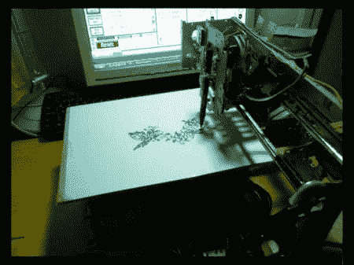

# 由备件制成的三轴绘图仪

> 原文：<https://hackaday.com/2011/06/23/3-axis-plotter-made-from-spare-parts/>

根据作者的说法，上面提到的绘图仪几乎完全是由回收的零件制成的。除了他所积累的，完成这个构建只需要 20 美元的零件。考虑到一台新绘图仪要花费数千美元，这已经很不错了。

所有轴的控制是使用单极步进电机完成的。在这种情况下，只有一个单极电机和两个双极电机可用。[Lovro]实际上是将这些设备改造成单极设置，以节省构建成本。

Mach3 控制软件连同并行端口用于控制步进器。一个类似的“垃圾”设置可以用来驱动数控铣床或激光雕刻机，所以在把旧打印机扔进垃圾桶之前要三思！休息之后，请查看该绘图仪的运行视频！另外，关于一台类似的使用 Mach3 控制软件的[激光雕刻机](http://hackaday.com/2010/01/27/building-a-bigger-better-laser-engraver/ "laser engraver")，请参见这篇黑客文章。 [https://www.youtube.com/embed/1XcvXbbDQNw?version=3&rel=1&showsearch=0&showinfo=1&iv_load_policy=1&fs=1&hl=en-US&autohide=2&wmode=transparent](https://www.youtube.com/embed/1XcvXbbDQNw?version=3&rel=1&showsearch=0&showinfo=1&iv_load_policy=1&fs=1&hl=en-US&autohide=2&wmode=transparent)