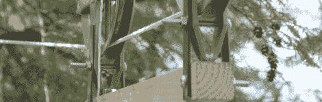

# 为您的周三下午准备 3 个相机吊杆

> 原文：<https://hackaday.com/2010/07/14/3-camera-booms-for-your-wednesday-afternoon/>

[Andrew]向我们透露了他用一些木材和晾衣绳做成的有线摄像机。它小到足以装进背包，包括一条安全线，相机可以平移和倾斜。未来的版本计划配备一个小型遥控马达，以更有效地移动手推车。

[Andrew]意外地将我们连接到他的另一台[摄像机起重机](http://colvins.ca/?p=44)，采用与他的有线摄像机相同的'[便宜](http://hackaday.com/2009/11/21/build-a-camera-boom-at-less-than-a-grand/)但有效'的方法。再一次，只是一些木材和创造性的工程被用来完成这个。

对于那些没有焊接能力的人来说，看看[Bill Van Loo's] [全木质版的摄像起重机](http://www.chromedecay.org/2010/04/16/1652-diy-camera-jibcrane/)。相同的平行四边形设计，没有远程视频输出或中央枢轴。