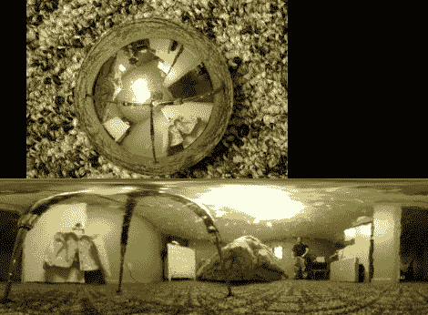

# 360 度摄影使用非常简单的后期处理

> 原文：<https://hackaday.com/2011/06/16/360-degree-photography-uses-very-easy-post-processing/>

[Pixel _ outline]一直在研究[一种用他的相机](http://ryanburnside.wordpress.com/2011/06/15/53/)拍摄 360 幅图像的方法。他用一个闪亮的圣诞球装饰品把整个房间反射到摄像机的镜头里。在打开的图像中，你可以看到他三脚架的三条腿。在那张快照中，他把装饰品放在地板上，然后把相机从上方指向下方。

引起我们注意的是他用来展开图像的后期处理。他加载了 Gimp T1，一个开源的图像处理程序，只用了三个步骤就打开了图像。首先，他将图片裁剪成正方形，球形装饰物完美地居中。然后他运行了极坐标过滤器。最后，他缩放图像，设置宽度为π乘以高度。对于不需要太多摆弄的东西来说，工作得非常好。

装饰物不是非常光滑(或者可能有点脏)，但是如果你使用一个带有银反射器的灯泡，就像我们在[这个老版本](http://hackaday.com/2010/01/04/360-degree-video-for-next-to-nothing/)中看到的那样，你可以得到一个更好的开始图像。