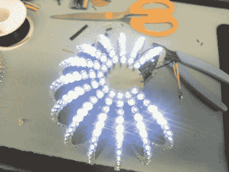

# 384 LED 球无线接收动画并知道其方向

> 原文：<https://hackaday.com/2012/02/16/384-led-ball-receives-animation-wirelessly-and-knows-its-orientation/>

我们得到了大量关于 Kickstarter 项目的提示。这是一个很好的例子，我们需要看到的，以突出其中之一。由 Null Space Labs 开发的这种 LED 发光球是一场雄心勃勃的筹款活动的目标。但是除了筹款报道之外，他们还分享了原型的大量细节。

球由十六片组成；每个都有自己的电路板，上面有一个 LED 驱动器。所有芯片都采用相同的 PCB 设计，但其中一个芯片在电路板上安装了 ATmega328 作为主机。主板上的可选组件包括一个加速度计和一个蓝牙模块来接收动画数据。为了获得最新原型的完整效果，你会想要在他们的 Kickstarter 页面上看到视频。

觉得这个球看着眼熟？最初的设计是由[Nikolai]作为一个朋友的表演作品开发的。这个版本的灵感来自于早期项目的[专题。](http://hackaday.com/2011/10/16/we-want-this-led-ball/)

因此，如果你打算将你的 Kickstarter 链接提交到 [Hackaday 的提示行](http://hackaday.com/contact-hack-a-day/)，就用这个作为模板。我们想知道这个项目的详细情况！