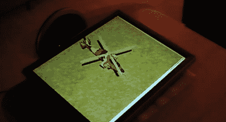

# 使用 Kinect 的 3D 显示

> 原文：<https://hackaday.com/2011/07/02/3d-display-using-a-kinect/>

Youtube 用户[programming4fun]在父亲节得到了一台 Kinect，只需要一点点代码，就可以只用一台 Kinect 实现 3D 显示。我们认为 Kinect 的“全息显示器”是我们见过的最有用的 Kinect 实现之一，而不是通常的 Kinect 黑客，如[计算机视觉](http://hackaday.com/2011/06/04/programming-robots-like-you-would-train-a-pet/)或。

该版本使用 Kinect SDK。最终结果与我们之前报道的 Kinect snowglobe 非常相似，只是它没有使用定制的丙烯酸圆顶和投影仪，而是在任何显示器上实现了伪 3D。黑客的工作原理是让 Kinect 追踪用户的头部。由此可见，显示 3D 模型的投影非常简单。

该系统仅支持一个人的 3D 显示，尽管有了[快门眼镜](http://en.wikipedia.org/wiki/Liquid_crystal_shutter_glasses)，可以增加一倍。[programming4fun]说他正在考虑添加立体 3D——虽然视频效果非常惊人，但他说这在现实生活中并不完全令人信服。

我们和极其谦虚的[编程乐趣]谈过，他说这个版本在技术上一点也不令人印象深刻。我们不同意这种评价，因为需要移动的界面从 1963 年就已经出现了[，它们仍然没有得到广泛的受众。虽然有一些动作控制设备](http://www.youtube.com/watch?v=mOZqRJzE8xg)[工作良好](http://en.wikipedia.org/wiki/Wii)，但大多数[都相当糟糕](http://www.youtube.com/watch?v=KZErvASwdlU)。Kinect 3D 显示器似乎可以与微软的 Surface type 设备一起使用。

[programming4fun]说，如果有足够的兴趣，他可能会被说服清理他的代码并创建一个安装程序。休息之后请看视频。

更新:[programming4fun]上传了[另一个带有“幕后”外观的演示](http://www.youtube.com/watch?v=9xMSGmjOZIg)。看看这个。

[https://www.youtube.com/embed/YDHJEbTPs7o?version=3&rel=1&showsearch=0&showinfo=1&iv_load_policy=1&fs=1&hl=en-US&autohide=2&wmode=transparent](https://www.youtube.com/embed/YDHJEbTPs7o?version=3&rel=1&showsearch=0&showinfo=1&iv_load_policy=1&fs=1&hl=en-US&autohide=2&wmode=transparent)