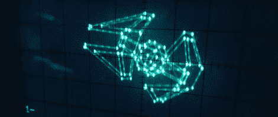

# 示波器上的 3D 图形

> 原文：<https://hackaday.com/2012/03/06/3d-graphics-on-an-oscilloscope/>

装备了四门翼尖安装的锡耶纳舰队系统 L-s9.3 激光炮和一台 SFS P-s5.6 双离子发动机的 TIE 截击机成为了义军舰队的祸害，几乎能在运行和机动上超越游牧中队心爱的 A 翼。由于[【马特】不知疲倦的工作](http://axio.ms/projects/scope3d/)，我们现在可以用我们的~~瞄准计算机~~示波器来可视化 TIE 截击机的逼近。

考虑到[Matt]使用非常少的硬件来显示 3D 图形，因此[Matt]的 TIE 战斗机示波器可视化是对我们已经看到的[之前示波器显示](http://hackaday.com/2011/08/01/want-to-play-pong-on-your-oscilloscope/)的巨大改进。该构建使用 ATMega88 和 10 位 DAC 在屏幕上画线。带有 8kB 闪存和 1kB SRAM 的大容量 Mega88 几乎被[Matt]的项目填满；为了提高显示器的渲染速度，正弦&余弦值会预先计算，并与常用值的除法表一起存储在闪存中。

TIE 战斗机的旋转由[Batt]桌面的串行连接控制。这是一部令人印象深刻的作品，看起来它符合《帝国反击战》的电影美学。休息之后，看看[Matt]在太空中旋转领带的视频。

[https://www.youtube.com/embed/S019rSEhRbY?version=3&rel=1&showsearch=0&showinfo=1&iv_load_policy=1&fs=1&hl=en-US&autohide=2&wmode=transparent](https://www.youtube.com/embed/S019rSEhRbY?version=3&rel=1&showsearch=0&showinfo=1&iv_load_policy=1&fs=1&hl=en-US&autohide=2&wmode=transparent)