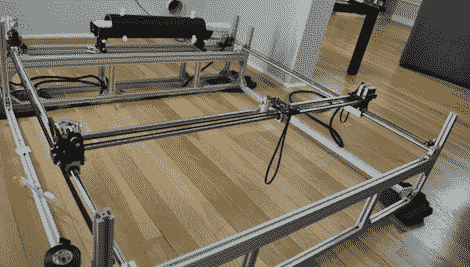

# 3D 可打印激光切割机

> 原文：<https://hackaday.com/2011/09/20/3d-printable-laser-cutter/>

[peter]送来一个他一直在做的可修复激光切割机。即使他仍然有一些问题，在整个平方米床上的光束精度，这仍然是一个惊人的建设。

建造[从一堆 t 型槽铝型材](http://builders.reprap.org/2011/05/boot-strappable-open-laser-cutter.html)开始。在收到[一个大得离谱的装有二氧化碳激光管的包裹](http://thingiverse-production.s3.amazonaws.com/assets/16/cf/50/dc/50/DSC_0628-1024.jpg)后，【彼得】开始着手在轴上安装马达。[光学系统](http://thingiverse-production.s3.amazonaws.com/renders/4e/60/39/c8/2d/DSC_0060-1024_display_large.jpg)在由老式步进电机&同步带驱动的轴台轴承上移动实心杆。

这台机器上 1 平方米的切割面积对于自制激光切割机来说是巨大的。[peter]发现，一旦必要的部件到位，你想买多少铝就成了切割区域的限制因素。[peter]把 3D 打印的车厢、支架和底座的文件放到 Thingiverse 上，希望他的设计可以被其他人改进。