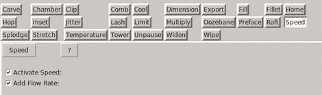

# 3d 打印机软件教程

> 原文：<https://hackaday.com/2012/02/15/3d-printer-software-tutorials/>

众所周知，3D 打印机社区非常分散。有三种型号的 RepRaps、Makerbot 的三种打印机套件和数百种“本周打印机”，让初学者纠结于每种机器的利弊是非常令人沮丧的。这些打印机的软件几乎和硬件本身一样被分割，但幸运的是[Mike]已经发布了一系列视频,因此初学者可以了解所有的软件包。

[Mike]使用了 [Alibre 3D CAD](http://www.alibre.com/) 软件来生成。所有可打印对象的 stl 文件。这些。stl 文件被非常流行的 [Skeinforge](http://wiki.bitsfrombytes.com/index.php/Skeinforge) 转换成打印机可读的 GCode。GCode 通过 [ReplicatorG](http://replicat.org/) 发送到【迈克】的 SUMPOD，这是一个很棒的程序，可以作为打印机的前端。

虽然我们想看一个关于 [Sfact](http://reprap.org/wiki/Sfact) 的教程，但是最新的热点在。stl 到 GCode 的转换，[Mike]在将 Skeinforge 的复杂性分解成易于管理的部分方面做得非常好。