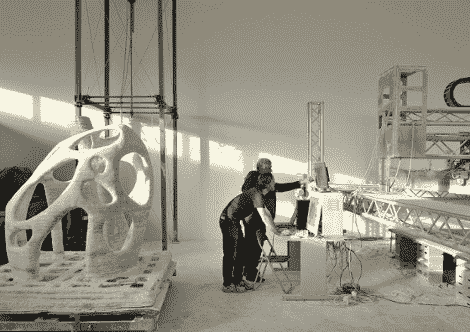

# 更大规模的 3D 打印

> 原文：<https://hackaday.com/2010/03/15/3d-printing-on-a-much-larger-scale/>

这台[巨型快速成型机](http://www.blueprintmagazine.co.uk/index.php/architecture/the-worlds-first-printed-building/)的最终目标是打印建筑。我们并没有屏住呼吸期待一个全新的[摩登原始人](http://en.wikipedia.org/wiki/The_Flintstones)风格的住所，但是他们异想天开的关于月球上印刷建筑的建议看起来像是有潜力的科幻小说。该机器的操作类似于 [RepRap](http://hackaday.com/2009/10/20/reprap-in-space-sorta/) ，但它不是塑料部件，而是通过用环氧树脂粘合沙子来打印石头。这种方法不是革命性的，但还没有真正在大于一平方米左右的应用中看到。看到我们涉足的东西走向工业生产应用是很有趣的。

[谢谢胡安]