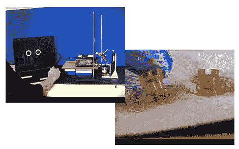

# 使用化学品的 3D 打印

> 原文：<https://hackaday.com/2010/07/15/3d-printing-with-chemicals/>

[出自马嘴](http://mrsec.wisc.edu/Edetc/nanolab/3D_print/index.html)，

"在这个光刻实验中，光从苯基双(2，4，6-三甲基苯甲酰基)氧化膦产生自由基，引发 1，6-己二醇二丙烯酸酯的聚合."

或者对于没有化学工程学位的人来说，来自(高分辨率)投影仪的光与一种特殊的液体相互作用，在表面产生一种坚硬的聚合物。液体中的平台被降低，带着聚合物层。再次照亮投影仪，产生另一层:泡沫，冲洗，重复。长话短说，一台非典型的 [3D 打印机](http://hackaday.com/2009/08/27/reprap-wedge/)使用[光](http://hackaday.com/2010/04/02/3d-laser-printer/)在一个非常[小的规模上](http://hackaday.com/2010/03/15/3d-printing-on-a-much-larger-scale/)。

你去拿化学药品和实验室设备，我们去拿笔记本电脑和投影仪，看在上帝的份上[吉米]别碰桌子了。

[谢谢托马斯]